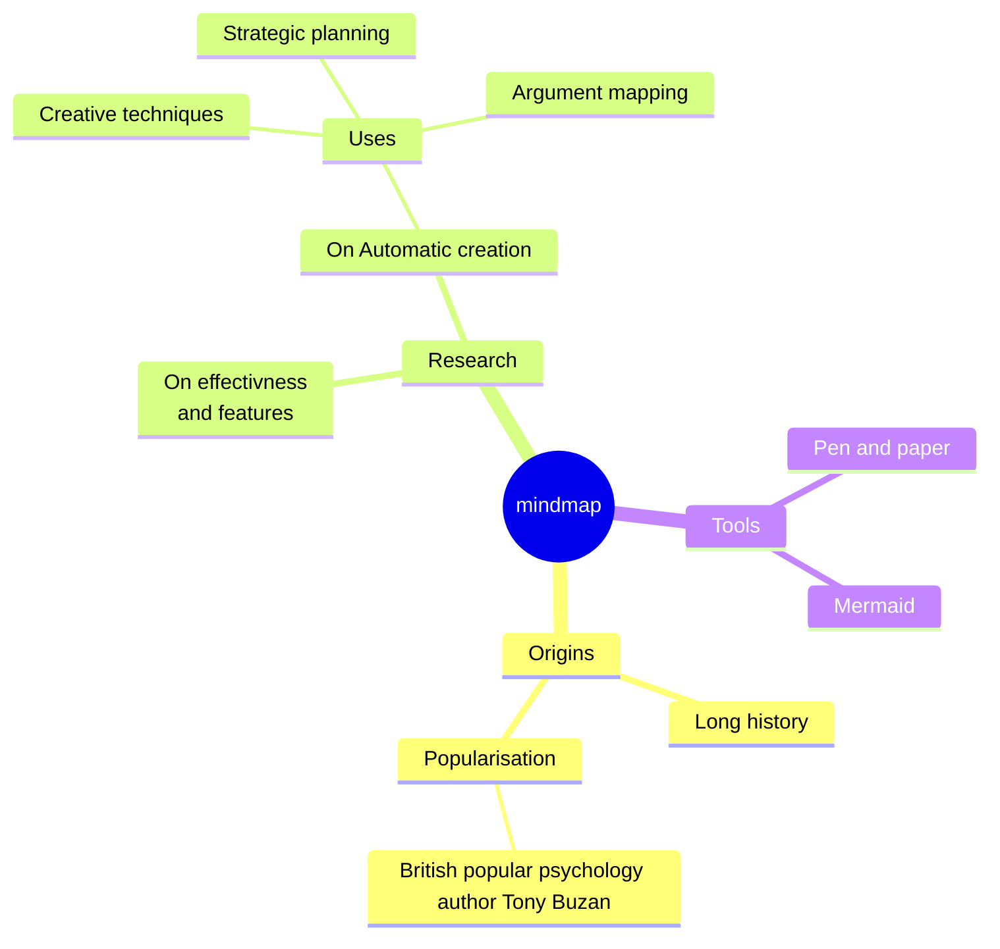

---
# try also 'default' to start simple
theme: ./slidev-theme-neon
colorSchema: light
# random image from a curated Unsplash collection by Anthony
# like them? see https://unsplash.com/collections/94734566/slidev
# background: https://cover.sli.dev
# apply any unocss classes to the current slide
class: "text-center"
# some information about the slides, markdown enabled
info: |
  ## Slidev Starter Template
  Presentation slides for developers.

  Learn more at [Sli.dev](https://sli.dev)
# transition: slide-left
title: CLI資産を活かせ! Claude Codeで整えるアウトプットワークフロー
mdc: true
---

## CLI資産を活かせ

# <span class="neon-flicker-cyan text-6xl font-bold">Claude Code</span>で整える

# アウトプットワークフロー

by もずます

<div class="neon-glow-matrix-colored orange absolute bottom-25 left-200 transform -rotate-15">2024/09/09 Qiita Bash</div>

---
layout: default
---

# デフォルトサイズ適用例

## 見出しレベル2

これは通常のテキストです。個別にサイズクラスを指定せずに、テーマのデフォルトサイズが適用されています。

### 見出しレベル3

- リストアイテムもデフォルトサイズ
- 自動的に適切なサイズで表示
- クラス指定不要

**太字テキスト**や*イタリック*も同じサイズ設定を継承します。

---
layout: two-cols-header
---

# Neon Text Effects

::left::

## 白抜きバージョン（デフォルト）

<div class="neon-glow-cyan text-3xl font-light tracking-wide">Cyberpunk Style</div>
<div class="neon-glow-matrix text-6xl font-bold tracking-mega uppercase">MATRIX</div>
<div class="neon-glow-pink text-4xl">Pink Neon</div>
<div class="neon-glow-purple text-4xl font-semibold">Purple Glow</div>
<div class="neon-glow-yellow text-4xl tracking-widest">Yellow Shine</div>
<div class="neon-glow-orange text-4xl font-thin">Orange Flame</div>

::right::

## 色付きバージョン

<div class="neon-glow-matrix-colored text-6xl font-bold uppercase">MATRIX</div>
<div class="neon-glow-pink-colored text-4xl">Pink Colored</div>
<div class="neon-glow-purple-colored text-4xl">Purple Colored</div>
<div class="neon-glow-yellow-colored text-4xl">Yellow Colored</div>
<div class="neon-glow-orange-colored text-4xl">Orange Colored</div>

---

# 点滅ネオンエフェクトデモ

<div class="neon-flicker-matrix text-6xl font-bold uppercase tracking-mega mb-8">MATRIX</div>

## 速度バリエーション

<div class="neon-glow-cyan neon-flicker-fast text-4xl mb-4">🚀 高速点滅</div>
<div class="neon-glow-purple neon-flicker text-4xl mb-4">⚡ 通常速度</div>
<div class="neon-glow-yellow neon-flicker-slow text-4xl">🌟 ゆっくり点滅</div>

---
layout: default
---

# Table of contents

<Toc maxDepth="1"></Toc>

---

::code-group

```sh [npm]
npm i @slidev/cli
```

```sh [yarn]
yarn add @slidev/cli
```

```sh [pnpm]
pnpm add @slidev/cli
```

::

---
transition: slide-up
---

# Navigation

Hover on the bottom-left corner to see the navigation's control panel, [learn more](https://sli.dev/guide/navigation.html)

## Keyboard Shortcuts

|                                                    |                             |
| -------------------------------------------------- | --------------------------- |
| <kbd>right</kbd> / <kbd>space</kbd>                | next animation or slide     |
| <kbd>left</kbd> / <kbd>shift</kbd><kbd>space</kbd> | previous animation or slide |
| <kbd>up</kbd>                                      | previous slide              |
| <kbd>down</kbd>                                    | next slide                  |

<p v-after class="absolute bottom-23 left-45 opacity-30 transform -rotate-10">Here!</p>

---
layout: image-right
image: <https://cover.sli.dev>
---

# Code

Use code snippets and get automatic highlighting, and even types hover![^1]

```ts {all|5|7|7-8|10|all} twoslash
// TwoSlash enables TypeScript hover information
// and errors in markdown code blocks
// More at https://shiki.style/packages/twoslash

import { computed, ref } from "vue";

const count = ref(0);
const doubled = computed(() => count.value * 2);

doubled.value = 2;
```

<arrow v-click="[4, 5]" x1="350" y1="310" x2="195" y2="334" color="#953" width="2" arrowSize="1" />

<!-- This allow you to embed external code blocks -->
<!-- <<< @/snippets/external.ts#snippet -->

<!-- Footer -->

[^1]: [Learn More](https://sli.dev/guide/syntax.html#line-highlighting)

<!-- Inline style -->
<style>
.footnotes-sep {
  @apply mt-5 opacity-10;
}
.footnotes {
  @apply text-sm opacity-75;
}
.footnote-backref {
  display: none;
}
</style>

---

# Components

<div grid="~ cols-2 gap-4">
<div>

You can use Vue components directly inside your slides.

We have provided a few built-in components like `<Tweet/>` and `<Youtube/>` that you can use directly. Adding your own custom components is also super easy.

```html
<Counter :count="10" />
```

<!-- ./components/Counter.vue -->
<Counter :count="10" m="t-4" />

Check out [the guides](https://sli.dev/builtin/components.html) for more.

</div>
<div>

```html
<Tweet id="1390115482657726468" />
```

<Tweet id="1390115482657726468" scale="0.65" />

</div>
</div>

<!--
Presenter notes with **bold**, *italic*, and ~~strike~~ text.

Also, HTML elements are valid:
<div class="flex w-full">
  <span style="flex-grow: 1;">Left content</span>
  <span>Right content</span>
</div>
-->

---
class: px-20
---

# Themes

Slidev comes with powerful theming support. Themes can provide styles, layouts, components, or even configurations for tools. Switch between themes on a per-slide basis with just **one change** in your frontmatter:

<div grid="~ cols-2 gap-2" m="t-2">

```yaml
---
theme: default
---
```

```yaml
---
theme: seriph
---
```


</div>

Read more about [How to use a theme](https://sli.dev/guide/theme-addon#use-theme) and
check out the [Awesome Themes Gallery](https://sli.dev/resources/theme-gallery).

---
preload: false
---

# Animations

Animations are powered by [@vueuse/motion](https://motion.vueuse.org/).

```html
<div v-motion :initial="{ x: -80 }" :enter="{ x: 0 }">Slidev</div>
```

<div class="w-60 relative mt-6">
  <div class="relative w-40 h-40">
    
    
    
  </div>

  <div
    class="text-5xl absolute top-14 left-40 text-[#2B90B6] -z-1"
    v-motion
    :initial="{ x: -80, opacity: 0}"
    :enter="{ x: 0, opacity: 1, transition: { delay: 2000, duration: 1000 } }">
    Slidev
  </div>
</div>

<!-- vue script setup scripts can be directly used in markdown, and will only affect the current page -->
<script setup lang="ts">
const final = {
  x: 0,
  y: 0,
  rotate: 0,
  scale: 1,
  transition: {
    type: 'spring',
    damping: 10,
    stiffness: 20,
    mass: 2
  }
}
</script>

<div
  v-motion
  :initial="{ x:35, y: 40, opacity: 0}"
  :enter="{ y: 0, opacity: 1, transition: { delay: 3500 } }">

[Learn More](https://sli.dev/guide/animations.html#motion)

</div>

---

# LaTeX

LaTeX is supported out-of-box powered by [KaTeX](https://katex.org/).

<br>

Inline $\sqrt{3x-1}+(1+x)^2$

Block

$$
{1|3|all}
\begin{array}{c}

\nabla \times \vec{\mathbf{B}} -\, \frac1c\, \frac{\partial\vec{\mathbf{E}}}{\partial t} &
= \frac{4\pi}{c}\vec{\mathbf{j}}    \nabla \cdot \vec{\mathbf{E}} & = 4 \pi \rho \\

\nabla \times \vec{\mathbf{E}}\, +\, \frac1c\, \frac{\partial\vec{\mathbf{B}}}{\partial t} & = \vec{\mathbf{0}} \\

\nabla \cdot \vec{\mathbf{B}} & = 0

\end{array}
$$

<br>

[Learn more](https://sli.dev/guide/syntax#latex)

---

# Diagrams

You can create diagrams / graphs from textual descriptions, directly in your Markdown.

<div class="grid grid-cols-4 gap-5 pt-4 -mb-6">





</div>

[Learn More](https://sli.dev/guide/syntax.html#diagrams)

---
layout: center
class: text-center
---

# Learn More

[Documentation](https://sli.dev) · [GitHub](https://github.com/slidevjs/slidev) · [Showcases](https://sli.dev/showcases.html)
